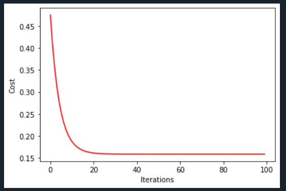

# Assignment #2: Linear Regression
## Name: Samar Ibrahim Antar
## plot best fit line for univariateData:

## plot_Iterations_with_cost for univariateData, final_cost=0.1584716080910898:

## plot_Iterations_with_cost for multivariateData, final_cost=0.1257163358797318:
